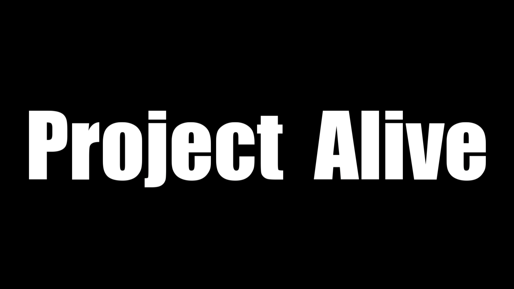
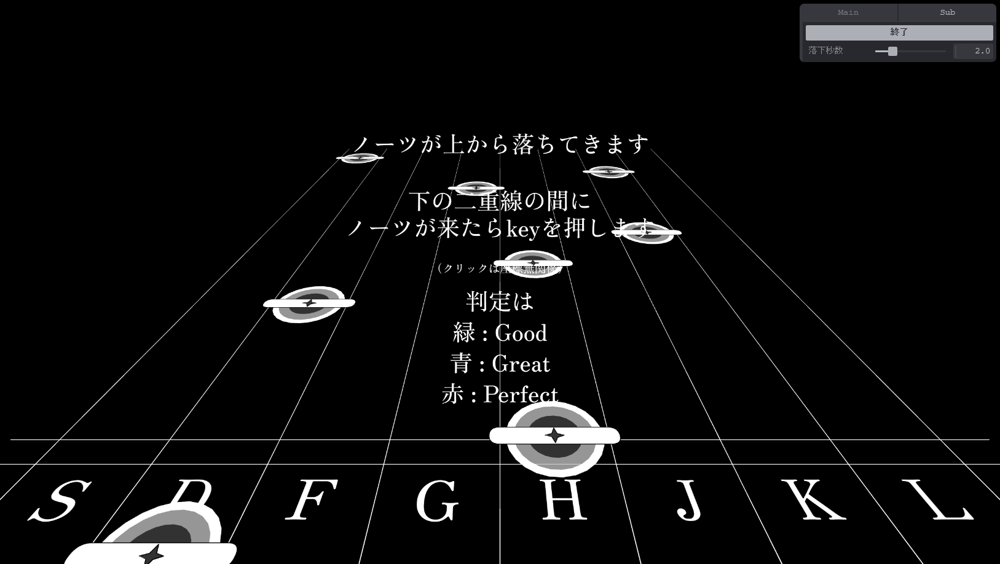

# マジカルミライ2023 プロコン
## Project Alive

## コンセプト
収録曲数世界一位の音ゲー

## 遊び方

ノーツの落下速度は1s～5sで選べます

スマホ対応もしてます

## こだわりポイント
マジミラ2020のアンマザの演出が好きなので、それを意識した背景演出 
~~（あの演出好きなのでまたやってください）~~ 
判定を重ねるごとに、演出がどんどんカラフルになっていきます！

## 投稿者コメント
名前の通り、ボカロの音ゲーです。 
しかし、この音ゲーの譜面はTextAliveの歌詞データを基に自動で生成されます！ 
そのため、TextAliveにデータがある全ての楽曲で遊ぶことができます！！！ 
（審査対象は一曲だけだそうなので、関係はなさそうですが...）

このアプリのかなめであるp5jsは初めて使うライブラリだったので、かなりの挑戦でした。 
音ゲーを作るのも初めてで、少し戸惑いながらも、ノーツのデザインや配置のアルゴリズムを考えました！

TextAliveを使った音ゲー、Project Aliveをよろしくお願いします！！！

## 使用ライブラリ
- [vite](https://vitejs.dev/)
- [p5js](https://p5js.org/)
- [tweakpane](https://cocopon.github.io/tweakpane/)

# 各種リンク

[プロコン dev用ページ](https://developer.textalive.jp/events/magicalmirai2023/)  
[プロコン 公式サイト](https://magicalmirai.com/2023/procon/)  
[フォント：Zen Old Mincho](https://fonts.google.com/specimen/Zen+Old+Mincho?query=zen+old)

# 発展
- 全楽曲対応（リンクで読み込ませる）
- リザルト画面
